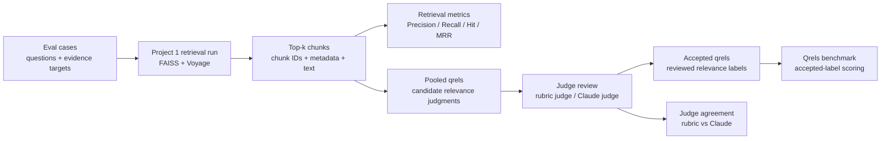
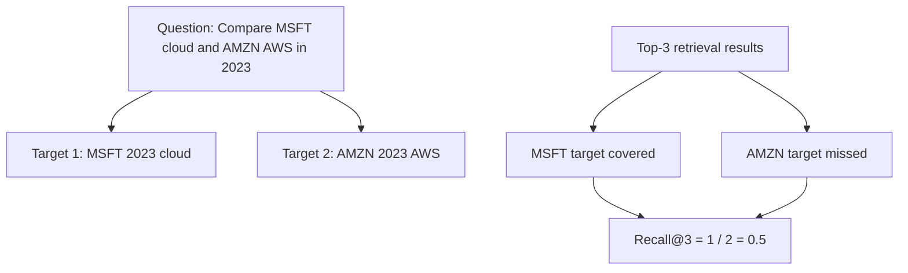
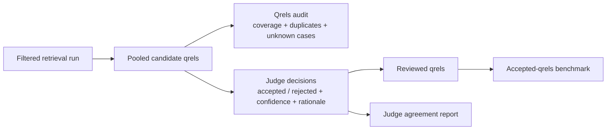

# Financial RAG Eval Suite

Companion evaluation system for [`financial-rag-engine`](https://github.com/irenechenn/financial-rag-engine).

This project evaluates whether a financial RAG retriever returns the right earnings-call transcript evidence. It includes retrieval metrics, qrels-based relevance judgments, judge-review workflows, regression comparison, agent trace checks, and JSON/Markdown benchmark reports.

## What It Evaluates

| Layer | Evaluation Coverage |
|---|---|
| Retrieval quality | Precision@K, Recall@K, Hit@K, MRR@K |
| Evidence coverage | Target-level ticker/year/topic matching |
| Qrels workflow | Pooled qrels, qrels audit, qrels scoring |
| Judge review | Local rubric judge and Claude judge decisions |
| Judge reliability | Rubric-vs-Claude agreement and disagreement analysis |
| Agent traces | Tool-call recall, argument accuracy, sequence pass |
| Regression testing | Baseline-vs-candidate summary and case-level deltas |

The base system is Project 1's Voyage + FAISS retrieval layer. This repository focuses on evaluation infrastructure rather than implementing another RAG engine.

## Evaluation Pipeline



## Key Results

### Target-Label Retrieval Benchmark

Real Project 1 retrieval run, `top_k=3`, Voyage finance embeddings, FAISS `IndexFlatIP` over L2-normalized vectors.

| Run | Case Type | Cases | Precision@3 | Recall@3 | Hit@3 | MRR@3 |
|---|---|---:|---:|---:|---:|---:|
| Unfiltered semantic | simple | 10 | 0.333 | 0.700 | 0.700 | 0.600 |
| Metadata-filtered | simple | 10 | 0.733 | 1.000 | 1.000 | 0.833 |
| Unfiltered semantic | comparison | 4 | 0.417 | 0.500 | 1.000 | 0.583 |
| Metadata-filtered | comparison | 4 | 0.833 | 0.625 | 1.000 | 0.875 |

Metadata-aware retrieval improves simple-case Precision@3 from `0.333` to `0.733` and simple-case Recall@3 from `0.700` to `1.000`.

### Claude-Judged Qrels Benchmark

The Claude judge reviewed 49 pooled qrels and produced 14 accepted judgments and 35 rejected judgments. The table below scores the same filtered retrieval run using only Claude-accepted qrels.

| Provider | Case Type | Cases | Precision@3 | Recall@3 | Hit@3 | MRR@3 |
|---|---|---:|---:|---:|---:|---:|
| voyage-faiss-filtered | simple | 10 | 0.233 | 0.700 | 0.700 | 0.350 |
| voyage-faiss-filtered | metadata_filtered | 6 | 0.167 | 0.500 | 0.500 | 0.306 |
| voyage-faiss-filtered | multi_hop | 4 | 0.000 | 0.000 | 0.000 | 0.000 |
| voyage-faiss-filtered | comparison | 4 | 0.333 | 0.750 | 0.750 | 0.458 |

Claude-accepted qrels are stricter than target-level labels. Some cases remain unlabeled because the judge rejected all pooled candidates for that case; those cases are surfaced explicitly in the report.

### Judge Agreement

| Baseline | Candidate | Shared Decisions | Agreements | Disagreements | Agreement Rate |
|---|---|---:|---:|---:|---:|
| local_rubric_judge_v1 | claude_judge | 49 | 46 | 3 | 0.939 |

The agreement report includes the three disagreement cases and each judge's rationale.

## Dataset

Evaluation cases live in [`eval_cases/retrieval_v1.jsonl`](eval_cases/retrieval_v1.jsonl).

| Category | Cases | Evidence Target Pattern |
|---|---:|---|
| simple | 10 | One company, one year, one topic |
| metadata_filtered | 6 | Ticker/year-specific retrieval checks |
| multi_hop | 4 | Same company across multiple years |
| comparison | 4 | Multiple companies or evidence targets |

Target-level labels make multi-hop and comparison cases stricter. A Microsoft-vs-Amazon comparison can require both `MSFT 2023 cloud` and `AMZN 2023 AWS`; retrieving only one side receives partial Recall@K.

## Metrics

| Metric | Measures | Formula |
|---|---|---|
| Precision@K | How clean the top-k retrieved chunks are | relevant chunks in top K / K |
| Recall@K | How many expected evidence targets were covered | covered evidence targets / total evidence targets |
| Hit@K | Whether at least one expected target was found | 1 if any target is covered, else 0 |
| MRR@K | How early the first relevant chunk appears | reciprocal rank of first relevant result |

For multi-hop and comparison cases, Recall@K measures target coverage across multiple required evidence targets.



## Qrels And Judge Review

Qrels are query/chunk relevance judgments. This project keeps qrels separate from eval cases so candidate labels do not silently become benchmark labels.



Judge decisions include:

| Field | Meaning |
|---|---|
| `decision` | `accepted` or `rejected` |
| `confidence` | Judge confidence from 0.0 to 1.0 |
| `rationale` | Concise explanation |
| `judge_model` | Judge provider/model identifier |
| `rubric_version` | Rubric used to make the judgment |

The local rubric judge is deterministic and useful as a baseline. The Claude judge provides semantic review and catches cases where exact keyword matching is too strict or too loose.

## Reports

| Report | Description |
|---|---|
| [`project1_voyage_faiss_top3_unfiltered.md`](reports/project1_voyage_faiss_top3_unfiltered.md) | Pure semantic retrieval baseline |
| [`project1_voyage_faiss_top3_tool_filtered.md`](reports/project1_voyage_faiss_top3_tool_filtered.md) | Metadata-aware filtered retrieval run |
| [`project1_voyage_faiss_top3_tool_filtered_qrels_claude_accepted.md`](reports/project1_voyage_faiss_top3_tool_filtered_qrels_claude_accepted.md) | Filtered run scored against Claude-accepted qrels |
| [`unfiltered_vs_filtered.md`](reports/unfiltered_vs_filtered.md) | Regression comparison between unfiltered and filtered retrieval |
| [`retrieval_v1_claude_judge_decisions.md`](qrels/retrieval_v1_claude_judge_decisions.md) | Claude judge decisions with confidence and rationale |
| [`retrieval_v1_claude_judged_qrels.md`](qrels/retrieval_v1_claude_judged_qrels.md) | Claude decisions applied to pooled qrels |
| [`retrieval_v1_claude_judged_qrels_audit.md`](qrels/retrieval_v1_claude_judged_qrels_audit.md) | Coverage and integrity audit for Claude-judged qrels |
| [`rubric_vs_claude_judge_agreement.md`](qrels/rubric_vs_claude_judge_agreement.md) | Agreement and disagreement analysis between rubric and Claude judges |

Additional qrels workflow artifacts are stored in [`qrels/`](qrels/) and candidate label audits are stored in [`label_candidates/`](label_candidates/).

## Documentation

| Document | Purpose |
|---|---|
| [`docs/METRICS.md`](docs/METRICS.md) | Retrieval and agent trace metric definitions |
| [`docs/DATASET.md`](docs/DATASET.md) | Dataset schema and labeling policy |
| [`docs/QRELS.md`](docs/QRELS.md) | Pooled qrels, judge review, qrels scoring, and agreement workflow |
| [`docs/AGENT_TRACE_EVAL.md`](docs/AGENT_TRACE_EVAL.md) | Tool-call and argument-level agent trace evaluation |
| [`docs/REGRESSION_COMPARISON.md`](docs/REGRESSION_COMPARISON.md) | Baseline-vs-candidate run comparison |
| [`docs/LABEL_HARDENING.md`](docs/LABEL_HARDENING.md) | Review workflow for promoting target-level matches into explicit chunk labels |

## Install

```powershell
python -m venv .venv
.\.venv\Scripts\Activate.ps1
pip install -e .[dev]
```

## Common Commands

Validate cases:

```powershell
financial-rag-eval validate-cases eval_cases/retrieval_v1.jsonl
```

Run Project 1 retrieval:

```powershell
financial-rag-eval run-project1-retrieval `
  --cases eval_cases/retrieval_v1.jsonl `
  --out sample_runs/project1_voyage_faiss_top3_tool_filtered.jsonl `
  --top-k 3 `
  --provider voyage-faiss-filtered `
  --use-expected-filters
```

Score a retrieval run:

```powershell
financial-rag-eval score-run `
  --cases eval_cases/retrieval_v1.jsonl `
  --run sample_runs/project1_voyage_faiss_top3_tool_filtered.jsonl `
  --k 3 `
  --out-json reports/project1_voyage_faiss_top3_tool_filtered.json `
  --out-md reports/project1_voyage_faiss_top3_tool_filtered.md
```

Export pooled qrels:

```powershell
financial-rag-eval export-qrels `
  --cases eval_cases/retrieval_v1.jsonl `
  --run sample_runs/project1_voyage_faiss_top3_tool_filtered.jsonl `
  --k 3 `
  --source project1_voyage_faiss_top3_tool_filtered `
  --out-jsonl qrels/retrieval_v1_pooled_top3.jsonl `
  --out-md qrels/retrieval_v1_pooled_top3.md
```

Run Claude judge:

```powershell
financial-rag-eval judge-qrels `
  --cases eval_cases/retrieval_v1.jsonl `
  --run sample_runs/project1_voyage_faiss_top3_tool_filtered.jsonl `
  --qrels qrels/retrieval_v1_pooled_top3.jsonl `
  --judge-provider claude `
  --judgment-status candidate `
  --out-jsonl qrels/retrieval_v1_claude_judge_decisions.jsonl `
  --out-md qrels/retrieval_v1_claude_judge_decisions.md
```

Compare judges:

```powershell
financial-rag-eval compare-judges `
  --baseline qrels/retrieval_v1_rubric_judge_decisions.jsonl `
  --candidate qrels/retrieval_v1_claude_judge_decisions.jsonl `
  --baseline-name local_rubric_judge_v1 `
  --candidate-name claude_judge `
  --out-json qrels/rubric_vs_claude_judge_agreement.json `
  --out-md qrels/rubric_vs_claude_judge_agreement.md
```

## Interpretation And Limitations

- The v1 dataset is a focused 24-case benchmark, not a broad production benchmark.
- Claude-judged qrels are model-assisted relevance labels and should be spot-checked before being treated as production benchmark labels.
- Cases with no accepted qrels are surfaced as unlabeled rather than hidden.
- Precision@K and Recall@K evaluate retrieval quality, not final answer correctness.
- The filtered benchmark uses expected metadata when available, so it should be interpreted separately from the unfiltered semantic baseline.
- The current scope intentionally excludes dashboarding, nDCG, and large-scale monitoring.
