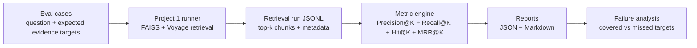
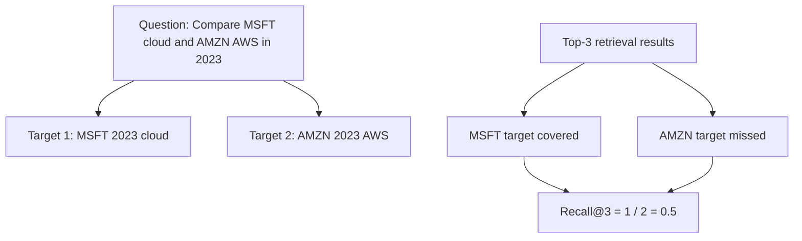
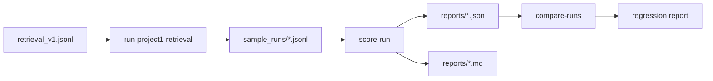

# Financial RAG Eval Suite

Companion retrieval evaluation suite for [`financial-rag-engine`](https://github.com/irenechenn/financial-rag-engine).

This project evaluates whether a financial RAG retriever returns the right earnings-call transcript evidence. It uses labeled retrieval cases, Precision@K, Recall@K, Hit@K, MRR@K, target-level evidence coverage, deterministic agent trace metrics, and JSON/Markdown reports with failure analysis.

## System Overview



## Evaluation Scope

| Component | Current Scope |
|---|---|
| Base system | `financial-rag-engine` retrieval layer |
| Embeddings | Voyage finance embeddings |
| Vector index | FAISS `IndexFlatIP` over L2-normalized vectors |
| Dataset | 24 labeled retrieval cases |
| Retrieval metrics | Precision@K, Recall@K, Hit@K, MRR@K |
| Labels | Target-level ticker/year/topic relevance criteria |
| Qrels | Pooled candidate relevance judgments for human review |
| Reports | JSON and Markdown |
| Failure analysis | Covered and missed evidence targets |
| Agent trace metrics | Tool call recall, argument accuracy, sequence pass |
| Regression comparison | Summary deltas and case-level changes across runs |

The benchmark tables below evaluate retrieval quality. The agent trace module adds deterministic tool-use checks, but the project does not yet evaluate final answer generation, citation quality, or end-to-end semantic correctness.

## Dataset

Evaluation cases live in [`eval_cases/retrieval_v1.jsonl`](eval_cases/retrieval_v1.jsonl).

| Category | Cases | Evidence Target Pattern |
|---|---:|---|
| simple | 10 | One company, one year, one topic |
| metadata_filtered | 6 | Ticker/year-specific retrieval checks |
| multi_hop | 4 | Same company across multiple years |
| comparison | 4 | Multiple companies or evidence targets |

Target-level labels make multi-hop and comparison cases stricter. For example, a Microsoft-vs-Amazon comparison can require both of these targets:

```text
MSFT 2023 cloud
AMZN 2023 AWS
```

Retrieving only one side receives partial Recall@K.

## Metrics

| Metric | Measures | Formula |
|---|---|---|
| Precision@K | How clean the top-k retrieved chunks are | relevant chunks in top K / K |
| Recall@K | How many expected evidence targets were covered | covered evidence targets / total evidence targets |
| Hit@K | Whether at least one expected target was found | 1 if any target is covered, else 0 |
| MRR@K | How early the first relevant chunk appears | reciprocal rank of first relevant result |

For simple cases, Recall@K usually has one target. For multi-hop and comparison cases, Recall@K measures target coverage across multiple required evidence targets.



## Documentation

| Document | Purpose |
|---|---|
| [`docs/METRICS.md`](docs/METRICS.md) | Retrieval and agent trace metric definitions |
| [`docs/DATASET.md`](docs/DATASET.md) | Dataset schema and labeling policy |
| [`docs/AGENT_TRACE_EVAL.md`](docs/AGENT_TRACE_EVAL.md) | Tool-call and argument-level agent trace evaluation |
| [`docs/REGRESSION_COMPARISON.md`](docs/REGRESSION_COMPARISON.md) | Baseline-vs-candidate run comparison |
| [`docs/LABEL_HARDENING.md`](docs/LABEL_HARDENING.md) | Human-review workflow for promoting target-level matches into explicit chunk labels |
| [`docs/QRELS.md`](docs/QRELS.md) | Pooled relevance judgment format and review workflow |

## Benchmark Results

Real Project 1 retrieval run, `top_k=3`, Voyage finance embeddings, FAISS `IndexFlatIP` over L2-normalized vectors.

### Unfiltered Semantic Retrieval

Searches with question text only. This is the pure semantic retrieval baseline.

| Provider | Case Type | Cases | Precision@3 | Recall@3 | Hit@3 | MRR@3 | Runtime Errors |
|---|---|---:|---:|---:|---:|---:|---:|
| voyage-faiss | comparison | 4 | 0.417 | 0.500 | 1.000 | 0.583 | 0 |
| voyage-faiss | metadata_filtered | 6 | 0.389 | 0.667 | 0.667 | 0.361 | 0 |
| voyage-faiss | multi_hop | 4 | 0.583 | 0.750 | 1.000 | 0.875 | 0 |
| voyage-faiss | simple | 10 | 0.333 | 0.700 | 0.700 | 0.600 | 0 |

### Tool-Style Filtered Retrieval

Applies expected ticker/year filters when the case has a single expected ticker and year. This represents metadata-aware retrieval, similar to the structured search path used by the base RAG agent.

| Provider | Case Type | Cases | Precision@3 | Recall@3 | Hit@3 | MRR@3 | Runtime Errors |
|---|---|---:|---:|---:|---:|---:|---:|
| voyage-faiss-filtered | comparison | 4 | 0.833 | 0.625 | 1.000 | 0.875 | 0 |
| voyage-faiss-filtered | metadata_filtered | 6 | 0.556 | 0.833 | 0.833 | 0.556 | 0 |
| voyage-faiss-filtered | multi_hop | 4 | 0.583 | 0.750 | 1.000 | 0.875 | 0 |
| voyage-faiss-filtered | simple | 10 | 0.733 | 1.000 | 1.000 | 0.833 | 0 |

## Result Interpretation

| Observation | Interpretation |
|---|---|
| Filtered retrieval improves simple-case Precision@3 from 0.333 to 0.733 | Metadata filters remove wrong-company and wrong-year chunks before ranking. |
| Filtered simple-case Recall@3 and Hit@3 reach 1.000 | Single-target questions are consistently covered when ticker/year constraints are available. |
| Filtered comparison Precision@3 is 0.833 but Recall@3 is 0.625 | Retrieved chunks are often relevant, but top-k may cover only one side of a comparison. |
| Filtered simple-case MRR@3 is 0.833 | Relevant evidence usually appears near the top of the ranked list. |
| Unfiltered retrieval remains lower across most categories | Query text alone is a harder baseline for company/year-specific financial retrieval. |

## Report Outputs



Generated Markdown reports are available here:

| Report | Description |
|---|---|
| [`project1_voyage_faiss_top3_unfiltered.md`](reports/project1_voyage_faiss_top3_unfiltered.md) | Pure semantic retrieval baseline |
| [`project1_voyage_faiss_top3_tool_filtered.md`](reports/project1_voyage_faiss_top3_tool_filtered.md) | Metadata-aware filtered retrieval run |
| [`unfiltered_vs_filtered.md`](reports/unfiltered_vs_filtered.md) | Regression comparison between unfiltered and filtered retrieval |
| [`tool_filtered_top3.md`](label_candidates/tool_filtered_top3.md) | Candidate `relevant_chunk_ids` for human relevance review |
| [`retrieval_v1_pooled_top3.md`](qrels/retrieval_v1_pooled_top3.md) | Pooled candidate qrels generated from the filtered top-3 run |

Markdown reports include:

| Section | Purpose |
|---|---|
| Benchmark Summary | Aggregate Precision@K, Recall@K, Hit@K, and MRR@K by provider and case type |
| Failure Analysis | Cases with missed evidence targets |
| Case Results | Per-case metric details |

Example failure analysis row:

| Case | Covered Targets | Missed Targets |
|---|---|---|
| `msft_cloud_vs_amzn_aws_2023` | MSFT 2023 cloud | AMZN 2023 AWS |

## Install

```powershell
python -m venv .venv
.\.venv\Scripts\Activate.ps1
pip install -e .[dev]
```

## Validate Cases

```powershell
financial-rag-eval validate-cases eval_cases/retrieval_v1.jsonl
```

## Run Project 1 Retrieval

Requires Project 1's `.env` with `VOYAGE_API_KEY` and an existing Project 1 FAISS index.

```powershell
financial-rag-eval run-project1-retrieval `
  --cases eval_cases/retrieval_v1.jsonl `
  --out sample_runs/project1_voyage_faiss_top3_unfiltered.jsonl `
  --top-k 3
```

Filtered/tool-style run:

```powershell
financial-rag-eval run-project1-retrieval `
  --cases eval_cases/retrieval_v1.jsonl `
  --out sample_runs/project1_voyage_faiss_top3_tool_filtered.jsonl `
  --top-k 3 `
  --provider voyage-faiss-filtered `
  --use-expected-filters
```

## Compare Two Reports

```powershell
financial-rag-eval compare-runs `
  --baseline reports/project1_voyage_faiss_top3_unfiltered.json `
  --candidate reports/project1_voyage_faiss_top3_tool_filtered.json `
  --baseline-name unfiltered `
  --candidate-name filtered `
  --out-json reports/unfiltered_vs_filtered.json `
  --out-md reports/unfiltered_vs_filtered.md
```

## Generate Label Candidates

```powershell
financial-rag-eval suggest-labels `
  --cases eval_cases/retrieval_v1.jsonl `
  --run sample_runs/project1_voyage_faiss_top3_tool_filtered.jsonl `
  --k 3 `
  --out-jsonl label_candidates/tool_filtered_top3.jsonl `
  --out-md label_candidates/tool_filtered_top3.md
```

This command produces review candidates only. Confirmed chunk IDs should be manually promoted into the eval cases before treating them as gold labels.

## Export Pooled Qrels

```powershell
financial-rag-eval export-qrels `
  --cases eval_cases/retrieval_v1.jsonl `
  --run sample_runs/project1_voyage_faiss_top3_tool_filtered.jsonl `
  --k 3 `
  --source project1_voyage_faiss_top3_tool_filtered `
  --out-jsonl qrels/retrieval_v1_pooled_top3.jsonl `
  --out-md qrels/retrieval_v1_pooled_top3.md
```

## Score A Retrieval Run

```powershell
financial-rag-eval score-run `
  --cases eval_cases/retrieval_v1.jsonl `
  --run sample_runs/project1_voyage_faiss_top3_unfiltered.jsonl `
  --k 3 `
  --out-json reports/project1_voyage_faiss_top3_unfiltered.json `
  --out-md reports/project1_voyage_faiss_top3_unfiltered.md
```

## Limitations

- The v1 dataset is small and should be treated as a focused retrieval benchmark, not a broad production benchmark.
- Target-level metadata/term labels are inspectable, but stable human-verified `relevant_chunk_ids` would make the benchmark stricter.
- Precision@K and Recall@K evaluate retrieval quality, not final answer correctness.
- The filtered benchmark uses expected metadata when available, so it should be interpreted separately from the unfiltered semantic baseline.
- The current scope does not include dashboarding, nDCG, or large-scale monitoring.
