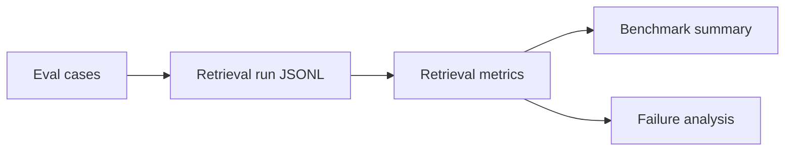

# Retrieval Evaluation Report

## Run Overview

| Field | Value |
|---|---|
| Metrics | Precision@3, Recall@3, Hit@3, MRR@3 |
| Label source | qrels:candidate |
| Cases scored | 24 |
| Providers | voyage-faiss-filtered |
| Case categories | comparison; metadata_filtered; multi_hop; simple |
| Cases with no relevant labels | 1 |
| Cases with missed targets or runtime errors | 0 |

## Benchmark Summary

| Provider | Case Type | Cases | Precision@K | Recall@K | Hit@K | MRR@K | Runtime Errors |
|---|---|---:|---:|---:|---:|---:|---:|
| voyage-faiss-filtered | comparison | 4 | 0.833 | 1.000 | 1.000 | 0.875 | 0 |
| voyage-faiss-filtered | metadata_filtered | 6 | 0.556 | 0.833 | 0.833 | 0.556 | 0 |
| voyage-faiss-filtered | multi_hop | 4 | 0.583 | 1.000 | 1.000 | 0.875 | 0 |
| voyage-faiss-filtered | simple | 10 | 0.733 | 1.000 | 1.000 | 0.833 | 0 |

## Failure Analysis

Cases below missed at least one expected evidence target or produced a runtime error.

| Case | Provider | Category | Recall@K | Hit@K | Covered Targets | Missed Targets / Error |
|---|---|---|---:|---:|---|---|
| _None_ |  |  |  |  |  |

## Unlabeled Cases

Cases below have zero relevant labels for the selected label source.

| Case | Provider | Category |
|---|---|---|
| tsla_2024_profitability_metadata | voyage-faiss-filtered | metadata_filtered |

## Case Results

| Case | Provider | Category | Precision@K | Recall@K | Hit@K | RR@K | Evidence Targets Covered |
|---|---|---|---:|---:|---:|---:|---:|
| aapl_2023_services_revenue | voyage-faiss-filtered | simple | 0.667 | 1.000 | 1.000 | 0.500 | 2/2 |
| tsla_2024_margin_comment | voyage-faiss-filtered | simple | 0.333 | 1.000 | 1.000 | 0.333 | 1/1 |
| nvda_2024_data_center | voyage-faiss-filtered | simple | 1.000 | 1.000 | 1.000 | 1.000 | 3/3 |
| msft_2024_cloud | voyage-faiss-filtered | simple | 1.000 | 1.000 | 1.000 | 1.000 | 3/3 |
| amzn_2023_aws | voyage-faiss-filtered | simple | 1.000 | 1.000 | 1.000 | 1.000 | 3/3 |
| meta_2024_advertising | voyage-faiss-filtered | simple | 0.667 | 1.000 | 1.000 | 1.000 | 2/2 |
| googl_2024_advertising | voyage-faiss-filtered | simple | 0.333 | 1.000 | 1.000 | 0.500 | 1/1 |
| msft_2023_cloud | voyage-faiss-filtered | simple | 0.667 | 1.000 | 1.000 | 1.000 | 2/2 |
| tsla_2023_margin_comment | voyage-faiss-filtered | simple | 0.667 | 1.000 | 1.000 | 1.000 | 2/2 |
| nvda_2023_data_center | voyage-faiss-filtered | simple | 1.000 | 1.000 | 1.000 | 1.000 | 3/3 |
| aapl_2024_services_metadata | voyage-faiss-filtered | metadata_filtered | 1.000 | 1.000 | 1.000 | 1.000 | 3/3 |
| amzn_2024_aws_metadata | voyage-faiss-filtered | metadata_filtered | 1.000 | 1.000 | 1.000 | 1.000 | 3/3 |
| meta_2023_advertising_metadata | voyage-faiss-filtered | metadata_filtered | 0.333 | 1.000 | 1.000 | 0.500 | 1/1 |
| googl_2023_advertising_metadata | voyage-faiss-filtered | metadata_filtered | 0.333 | 1.000 | 1.000 | 0.333 | 1/1 |
| msft_2024_azure_metadata | voyage-faiss-filtered | metadata_filtered | 0.667 | 1.000 | 1.000 | 0.500 | 2/2 |
| tsla_2024_profitability_metadata | voyage-faiss-filtered | metadata_filtered | 0.000 | 0.000 | 0.000 | 0.000 | 0/0 |
| aapl_services_2023_vs_2024 | voyage-faiss-filtered | multi_hop | 0.333 | 1.000 | 1.000 | 1.000 | 1/1 |
| tsla_margin_2023_vs_2024 | voyage-faiss-filtered | multi_hop | 0.333 | 1.000 | 1.000 | 0.500 | 1/1 |
| nvda_data_center_2023_vs_2024 | voyage-faiss-filtered | multi_hop | 0.667 | 1.000 | 1.000 | 1.000 | 2/2 |
| msft_cloud_2023_vs_2024 | voyage-faiss-filtered | multi_hop | 1.000 | 1.000 | 1.000 | 1.000 | 3/3 |
| msft_cloud_vs_amzn_aws_2023 | voyage-faiss-filtered | comparison | 1.000 | 1.000 | 1.000 | 1.000 | 3/3 |
| googl_ads_vs_meta_ads_2024 | voyage-faiss-filtered | comparison | 0.667 | 1.000 | 1.000 | 0.500 | 2/2 |
| aapl_services_vs_msft_cloud_2024 | voyage-faiss-filtered | comparison | 1.000 | 1.000 | 1.000 | 1.000 | 3/3 |
| tsla_margin_vs_nvda_data_center_2024 | voyage-faiss-filtered | comparison | 0.667 | 1.000 | 1.000 | 1.000 | 2/2 |
