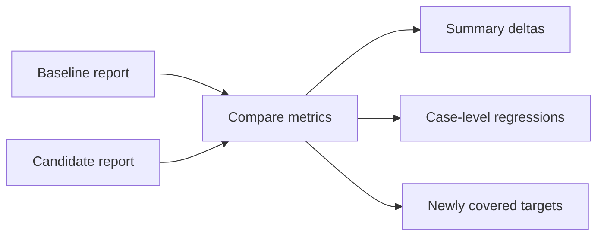

# Retrieval Run Comparison

## Overview

| Field | Value |
|---|---|
| Baseline | unfiltered |
| Candidate | filtered |
| Metrics | Precision@3, Recall@3, Hit@3, MRR@3 deltas |

## Summary Deltas

Positive values mean the candidate improved over the baseline.

| Category | Cases | Precision Delta | Recall Delta | Hit Delta | MRR Delta | Runtime Error Delta |
|---|---:|---:|---:|---:|---:|---:|
| comparison | 4 | +0.417 | +0.125 | +0.000 | +0.292 | +0 |
| metadata_filtered | 6 | +0.167 | +0.167 | +0.167 | +0.194 | +0 |
| multi_hop | 4 | +0.000 | +0.000 | +0.000 | +0.000 | +0 |
| simple | 10 | +0.400 | +0.300 | +0.300 | +0.233 | +0 |

## Case-Level Changes

| Case | Category | Status | Precision Delta | Recall Delta | Hit Delta | MRR Delta | Newly Covered | Newly Missed |
|---|---|---|---:|---:|---:|---:|---|---|
| aapl_2023_services_revenue | simple | improved | +0.667 | +1.000 | +1.000 | +0.500 | AAPL 2023 services revenue | - |
| aapl_services_vs_msft_cloud_2024 | comparison | improved | +0.667 | +0.500 | +0.000 | +0.667 | MSFT 2024 cloud | - |
| amzn_2023_aws | simple | improved | +1.000 | +1.000 | +1.000 | +1.000 | AMZN 2023 aws | - |
| amzn_2024_aws_metadata | metadata_filtered | improved | +0.333 | +0.000 | +0.000 | +0.500 | - | - |
| meta_2023_advertising_metadata | metadata_filtered | improved | +0.333 | +1.000 | +1.000 | +0.500 | META 2023 advertising | - |
| meta_2024_advertising | simple | improved | +0.333 | +0.000 | +0.000 | +0.000 | - | - |
| msft_2023_cloud | simple | improved | +0.333 | +0.000 | +0.000 | +0.500 | - | - |
| msft_2024_azure_metadata | metadata_filtered | improved | +0.333 | +0.000 | +0.000 | +0.167 | - | - |
| msft_2024_cloud | simple | improved | +0.333 | +0.000 | +0.000 | +0.000 | - | - |
| msft_cloud_vs_amzn_aws_2023 | comparison | improved | +0.667 | +0.000 | +0.000 | +0.500 | - | - |
| nvda_2023_data_center | simple | improved | +0.333 | +0.000 | +0.000 | +0.000 | - | - |
| nvda_2024_data_center | simple | improved | +0.667 | +0.000 | +0.000 | +0.000 | - | - |
| tsla_2024_margin_comment | simple | improved | +0.333 | +1.000 | +1.000 | +0.333 | TSLA 2024 margin | - |
| tsla_margin_vs_nvda_data_center_2024 | comparison | improved | +0.333 | +0.000 | +0.000 | +0.000 | - | - |
